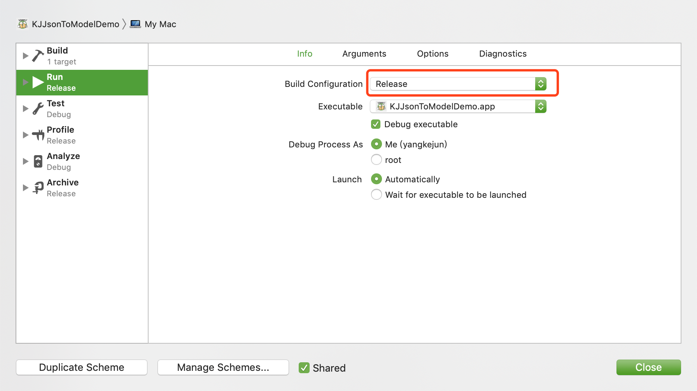

# Mac 软件打包成dmg文件

####一、生成App文件
####1、修改 Edit scheme 为 Release 模式，然后Command + B  

  

####2、找到生成的 `KJJsonToModelDemo.app` 文件  

  

####3、Show in Finder 即可看见该App文件  
####4、将该App移至桌面放在一个文件夹当中，便于操作 
> 备注:如需重新生成，需要先删掉原来的App文件

####二、使用磁盘工具
####1、打开 磁盘工具  
####2、点击 磁盘工具的目录栏，选择 文件 — 新建映像 — 来自文件夹的映像  

  

####3、选择刚刚存放App文件的文件夹    
####4、填写并保存dmg文件  

