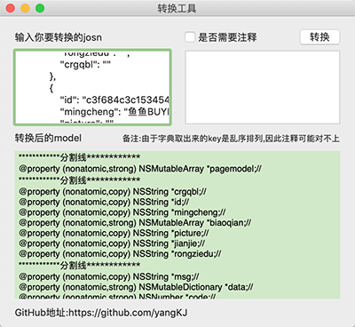

# KJJsonToModelDemo
一款json转model工具  
<p align="left">
  
</p>

----------------------------------------
### 框架整体介绍
* [作者信息](#作者信息)
* [作者其他库](#作者其他库)
* [使用方法](#使用方法)

#### <a id="作者信息"></a>作者信息
> Github地址：https://github.com/yangKJ  
> 简书地址：https://www.jianshu.com/u/c84c00476ab6  
> 博客地址：https://blog.csdn.net/qq_34534179  

#### <a id="作者其他库"></a>作者其他Pod库
```
播放器 - KJPlayer是一款视频播放器，AVPlayer的封装，继承UIView
pod 'KJPlayer'  # 播放器功能区
pod 'KJPlayer/KJPlayerView'  # 自带展示界面

实用又方便的Category和一些自定义控件
pod 'KJEmitterView'
pod 'KJEmitterView/Function'#
pod 'KJEmitterView/Control' # 自定义控件

轮播图 - 支持缩放 多种pagecontrol 支持继承自定义样式 自带网络加载和缓存
pod 'KJBannerView'  # 轮播图，网络图片加载

菜单控件 - 下拉控件 选择控件
pod 'KJMenuView' # 菜单控件

加载Loading - 多种样式供选择
pod 'KJLoadingAnimation' # 加载控件

```

##### Issue
如果您在使用中有好的需求及建议，或者遇到什么bug，欢迎随时issue，我会及时的回复，有空也会不断优化更新这些库

#### <a id="使用方法"></a>使用方法
```
将需要转换的json字符串放在坐标框内，转换即可
```
实现代码

```
//
//  ViewController.m
//  KJJsonToModelDemo
//
//  Created by 杨科军 on 2019/10/12.
//  Copyright © 2019 杨科军. All rights reserved.
//

#import "ViewController.h"

@interface ViewController ()
@property (nonatomic,strong) NSMutableArray *temps;
@property (weak) IBOutlet NSButton *annotationButton;
@property (weak) IBOutlet NSTextField *jsonTextField;
@property (weak) IBOutlet NSTextField *annotationTextField;
@property (weak) IBOutlet NSTextField *githubLabel;
@property (unsafe_unretained) IBOutlet NSTextView *modelTextView;

@end

@implementation ViewController

- (void)viewDidLoad {
    [super viewDidLoad];

    self.temps = [NSMutableArray array];
    // Do any additional setup after loading the view.
}


- (void)setRepresentedObject:(id)representedObject {
    [super setRepresentedObject:representedObject];

    // Update the view, if already loaded.
}

#pragma mark - json转字典
- (NSDictionary *)getDictWithJsonString:(NSString *)jsonString{
    jsonString = [[[[jsonString stringByReplacingOccurrencesOfString:@"\n" withString:@""]stringByReplacingOccurrencesOfString:@"\t" withString:@""]stringByReplacingOccurrencesOfString:@" " withString:@""]stringByReplacingOccurrencesOfString:@"\\" withString:@""];
    /// 解析字典
    jsonString = [jsonString stringByReplacingOccurrencesOfString:@";};" withString:@"};"];
    jsonString = [jsonString stringByReplacingOccurrencesOfString:@";}" withString:@"}"];
    jsonString = [jsonString stringByReplacingOccurrencesOfString:@";" withString:@","];
    jsonString = [jsonString stringByReplacingOccurrencesOfString:@"=" withString:@":"];
    jsonString = [jsonString stringByReplacingOccurrencesOfString:@"(" withString:@"["];
    jsonString = [jsonString stringByReplacingOccurrencesOfString:@")" withString:@"]"];
    NSString *regex = @"[,{].*?:";
    NSError *error;
    NSRegularExpression *regular = [NSRegularExpression regularExpressionWithPattern:regex options:NSRegularExpressionCaseInsensitive error:&error];
    NSArray *matches = [regular matchesInString:jsonString options:0 range:NSMakeRange(0, jsonString.length)];
    NSMutableString* jsonMuStr = [[NSMutableString alloc]initWithString:jsonString];
    int i = 1;
    for (NSTextCheckingResult *match in matches) {
        NSRange range = [match range];
        NSString *mStr = [jsonString substringWithRange:range];
        if(![mStr containsString:@"\""]){
            [jsonMuStr insertString:@"\"" atIndex:range.location + i];
            i += 2;
            [jsonMuStr insertString:@"\"" atIndex:range.location + i + range.length - 3];
        }
    }
    ///
    jsonString = [self correctErrValueWithJsonString:jsonMuStr];
    NSData *jsonData = [jsonString dataUsingEncoding:NSUTF8StringEncoding];
    NSError *err;
    NSDictionary *dic = [NSJSONSerialization JSONObjectWithData:jsonData options:NSJSONReadingMutableContainers error:&err];
    if(err) {
        [self errorHint];
        return nil;
    }
    return dic;
}
- (NSString *)correctErrValueWithJsonString:(NSString *)jsonStr{
    NSString *regex = @":.*?,";
    NSError *error;
    NSRegularExpression *regular = [NSRegularExpression regularExpressionWithPattern:regex options:NSRegularExpressionCaseInsensitive error:&error];
    NSArray *matches = [regular matchesInString:jsonStr options:0 range:NSMakeRange(0, jsonStr.length)];
    NSMutableString* jsonMuStr = [[NSMutableString alloc]initWithString:jsonStr];
    int i = 1;
    for (NSTextCheckingResult *match in matches) {
        NSRange range = [match range];
        NSString *mStr = [jsonStr substringWithRange:range];
        if(mStr.length > 2)
        mStr = [mStr substringWithRange:NSMakeRange(1, mStr.length - 2)];
        if(![mStr containsString:@"\""] && ![self isPureNumber:mStr] && ![mStr containsString:@"}"] && ![mStr containsString:@"["] && ![mStr containsString:@"true"] && ![mStr containsString:@"false"]){
            [jsonMuStr insertString:@"\"" atIndex:range.location + i];
            i += 2;
            [jsonMuStr insertString:@"\"" atIndex:range.location + i + range.length - 3];
        }
    }
    return jsonMuStr;
}
- (BOOL)isPureNumber:(NSString*)string{
    return [self isPureInt:string] || [self isPureFloat:string];
}
- (BOOL)isPureInt:(NSString*)string{
    NSScanner* scan = [NSScanner scannerWithString:string];
    int val;
    return[scan scanInt:&val] && [scan isAtEnd];
}
- (BOOL)isPureFloat:(NSString*)string{
    NSScanner* scan = [NSScanner scannerWithString:string];
    float val;
    return[scan scanFloat:&val] && [scan isAtEnd];
}
/// 错误提示
- (void)errorHint{
    NSAlert *alert = [[NSAlert alloc]init];
    [alert addButtonWithTitle:@"确定"];
    alert.messageText = @"错误";
    alert.informativeText = @"json字符串不合法";
    [alert setAlertStyle:NSAlertStyleWarning];
    [alert beginSheetModalForWindow:[self.view window] completionHandler:^(NSModalResponse returnCode) {
        
    }];
}
/// 开始转换
- (IBAction)thouchTransformButtonAction:(NSButton *)sender {
    [self.temps removeAllObjects];
    NSString *jsonStr = self.jsonTextField.stringValue;
    if(!jsonStr.length){
        [self errorHint];
        return;
    }
    NSDictionary *resultDic = [self getDictWithJsonString:jsonStr];
    [self recursionForResultWithObj:resultDic];
    NSMutableArray *finalResultArr = [NSMutableArray array];
    for (NSArray *subArr in self.temps) {
        if(![finalResultArr containsObject:subArr]){
            [finalResultArr addObject:subArr];
        }
    }
    finalResultArr = (NSMutableArray *)[[finalResultArr reverseObjectEnumerator] allObjects];
    NSString *outputString = @"";
    /// 分割注释
    NSArray *annArr = [self.annotationTextField.stringValue componentsSeparatedByString:@"\n"];
    NSInteger count = annArr.count;
    for (NSArray *subArr in finalResultArr) {
        outputString = [outputString stringByAppendingString:@"************分割线************\n"];
        for (NSInteger i=0; i<subArr.count; i++) {
            NSString *tempString;
            NSString *string = subArr[i];
            if(self.annotationButton.state == NSControlStateValueOn){
                NSString *annStr = @"";
                if (i<count) {
                    annStr = annArr[i];
                }
               tempString = [NSString stringWithFormat:@"/// %@\n%@",annStr,string];
            }else{
               tempString = string;
            }
            outputString = [outputString stringByAppendingString:tempString];
        }
    }
    self.modelTextView.string = outputString;   
}
#pragma mark - 递归解析
- (void)recursionForResultWithObj:(id)obj{
    if([obj isKindOfClass:[NSArray class]]){
        for (id subObj in obj) {
            [self recursionForResultWithObj:subObj];
        }
    }else if([obj isKindOfClass:[NSDictionary class]]){
        NSMutableArray *temp = [NSMutableArray array];
        for (NSString *key in ((NSDictionary*)obj).allKeys){
            id value = [obj objectForKey:key];
            if([value isKindOfClass:[NSArray class]] || [value isKindOfClass:[NSDictionary class]]){
                [temp addObject:[NSString stringWithFormat:@"@property (nonatomic,strong) %@ *%@;//\n",[[value superclass] class],key]];
                [self recursionForResultWithObj:value];
            }else{
                if([value isKindOfClass:[NSString class]]){
                    [temp addObject:[NSString stringWithFormat:@"@property (nonatomic,copy) %@ *%@;//\n",[NSString class],key]];
                }else if([value isKindOfClass:[NSNumber class]]){
                    [temp addObject:[NSString stringWithFormat:@"@property (nonatomic,strong) %@ *%@;//\n",[NSNumber class],key]];
                }else{
                    [temp addObject:[NSString stringWithFormat:@"@property (nonatomic,strong) %@ *%@;//\n",@"id",key]];
                }
            }
            [self.temps addObject:temp];
        }
    }
}

@end

```

